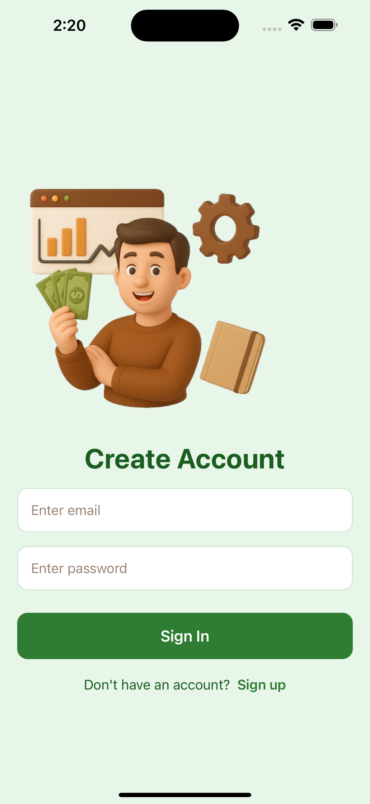
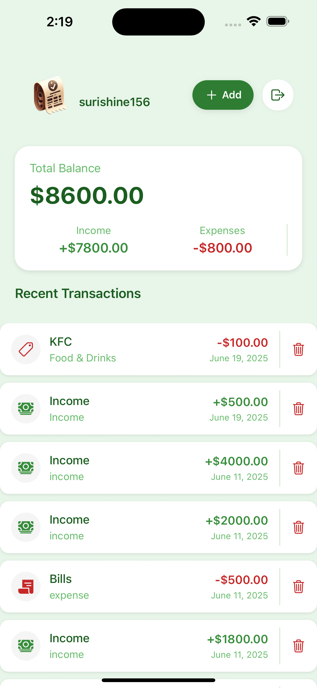
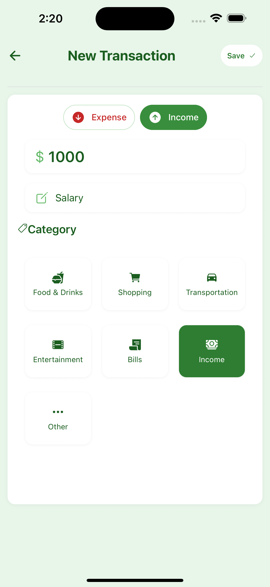

# Welcome to your Expo app 👋 
# 💰 React Native Wallet Tracker

A cross-platform expense and income tracker built using **React Native**, **Expo**, and **Clerk Authentication**.
This is an [Expo](https://expo.dev) project created with [`create-expo-app`](https://www.npmjs.com/package/create-expo-app).

## ✨ Features

- 🔐 User Authentication via Clerk
- 💵 Track Income & Expenses
- 📊 View Summary Balance
- 🧾 Create/Delete Transactions
- 📱 Responsive UI for Android & iOS

## 🛠 Tech Stack

- React Native (Expo)
- Clerk (Authentication)
- Node.js + Express (Backend API)
- Render (Backend Hosting)

## 📷 Screenshots
<p align="center">
  
  
  
</p>

<p align="center">
  <i>Create Account &nbsp;&nbsp;&nbsp; | &nbsp;&nbsp;&nbsp; Balance Summary &nbsp;&nbsp;&nbsp; |  &nbsp;&nbsp;&nbsp; New Transaction &nbsp;&nbsp;&nbsp; </i>
</p>


## Get started

1. Clone the repo
   ```bash
   git clone https://github.com/your-username/your-repo.git
   cd your-repo
   ```

2 Install dependencies
   ```bash
   npm install
   ```

3. Start the app
   ```bash
   npx expo start
   ```

In the output, you'll find options to open the app in a

- [development build](https://docs.expo.dev/develop/development-builds/introduction/)
- [Android emulator](https://docs.expo.dev/workflow/android-studio-emulator/)
- [iOS simulator](https://docs.expo.dev/workflow/ios-simulator/)
- [Expo Go](https://expo.dev/go), a limited sandbox for trying out app development with Expo

You can start developing by editing the files inside the **app** directory. This project uses [file-based routing](https://docs.expo.dev/router/introduction).

## Get a fresh project

When you're ready, run:

```bash
npm run reset-project
```

This command will move the starter code to the **app-example** directory and create a blank **app** directory where you can start developing.
## 🔌 Backend API Setup
Express backend is running and accessible at: https://rn-wallet-api-onq9.onrender.com

## Learn more

To learn more about developing your project with Expo, look at the following resources:

- [Expo documentation](https://docs.expo.dev/): Learn fundamentals, or go into advanced topics with our [guides](https://docs.expo.dev/guides).
- [Learn Expo tutorial](https://docs.expo.dev/tutorial/introduction/): Follow a step-by-step tutorial where you'll create a project that runs on Android, iOS, and the web.

## Join the community

Join our community of developers creating universal apps.

- [Expo on GitHub](https://github.com/expo/expo): View our open source platform and contribute.
- [Discord community](https://chat.expo.dev): Chat with Expo users and ask questions.
